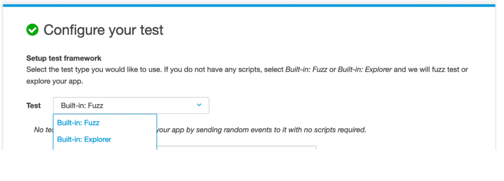
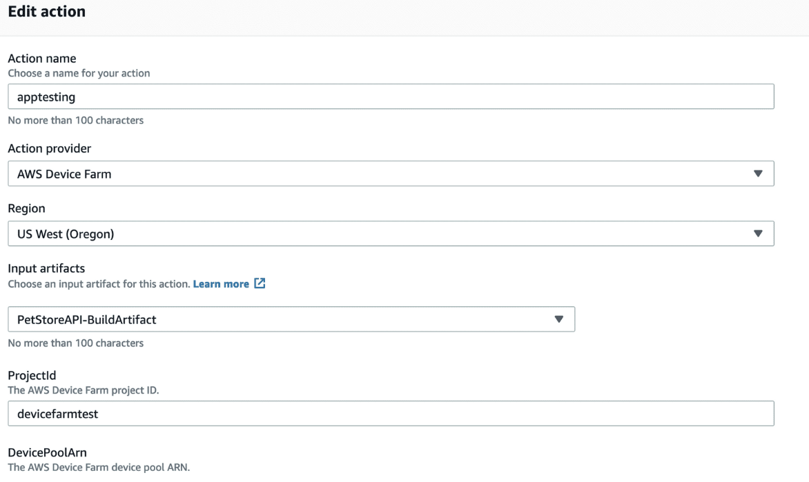

## Regression testing ensures your changes to the codebase do not disrupt already existing functions and cause something to break elsewhere.

Regression testing can involve running a large number of tests. Certain testing techniques have been developed to reduce the number of tests that need to be run, minimizing the time it takes to carry out testing while providing adequate code coverage.

# AWS Device Farm
AWS Device Farm is a service that enables you to test your Android, Fire, and iOS operating system apps on real devices, not emulators or simulators. The service allows you to view videos, screenshots, logs, and performance data to pinpoint and fix issues. 

With Device Farm, you can leverage a number of supported test automation frameworks.

## Built-in test types
- Built-in: Fuzz: The built-in fuzz test randomly sends user interface events to devices and then reports results.
- Built-in: Explorer: The built-in explorer test crawls your app by analyzing each screen and interacting with it as if it were an end-user, taking screenshots as it explores. You can also provide Device Farm with credentials so the test can sign in.

The following is an example of how Device Farm can be integrated with CodePipeline, using the console, to run tests as part of a continuous integration flow. 

The pipeline should be configured with a test stage that receives an input artifact containing your test definition and compiled app package files. The test stage input artifact can be the output artifact of either a source or build stage configured in your pipeline. 

