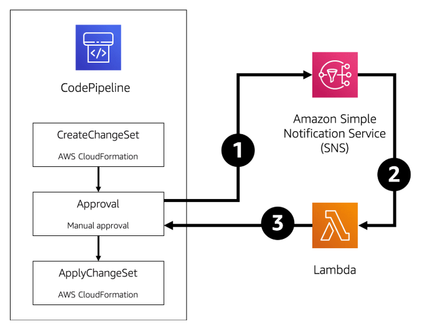

## This example illustrates how to automate the approval process using a Lambda function.



Step 1: When your application reaches the approval stage, CodePipeline can send an event to an Amazon SNS topic.
Step 2 : The Amazon SNS topic sends out notifications to all necessary resources including the Lambda function that will perform the test.
Step 3 : The Lambda function can perform testing and respond to the approval request. These tests include making sure a key functionality completes successfully. It takes the output from the test and compares it against an expected result. 

If the test is successful, the Lambda function will report back the decision to approve or deny the request.

## Here’s an example of Python code that will approve an approval action.
```sh
client = boto3.client('codepipeline')
response = client.get_pipeline_state(name=pipeline_name)

approve = _json_parsing_magic(response)

if approve:
  client.put_approval_result(
    pipelineName=pipeline_name,
    stageName=stage_name,
    actionName=action_name,
    result={
        'summary': 'Automatically approved by Lambda.',
        'status': 'Approved'
    },
    token=token
  )
```