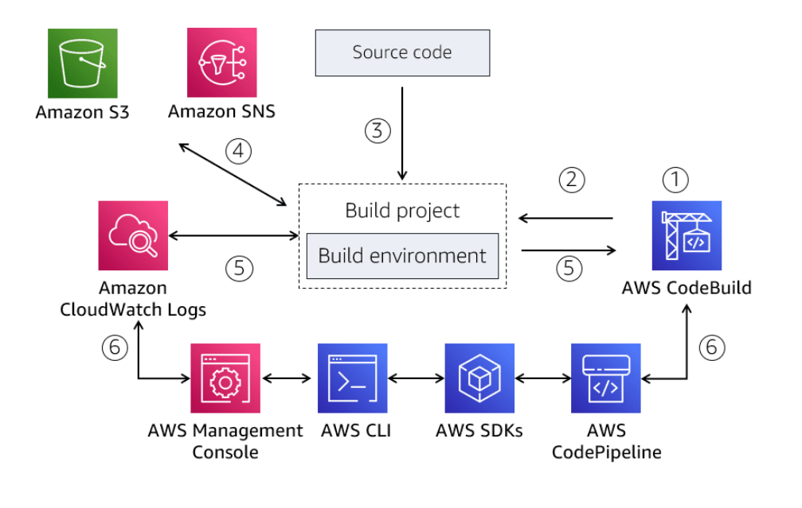

# AWS CodeBuild
AWS CodeBuild is a fully managed build service that automatically compiles source code, runs tests, and produces software packages. 

## With CodeBuild you can:
- Eliminate the need to set up, patch, update, and manage your own build servers, since CodeBuild is fully managed.
- Automatically compile source code, run tests, and produce build artifacts.
- Specify build commands to run at each phase of the build.
- Process multiple builds concurrently, for example, developers can continuously build and test their code, catch errors early, and correct them early.
- Leverage out of the box preconfigured build environments (such as .NET Core, Java, Ruby, Python, Go, NodeJS, Android and Docker). Build environments contain the operating system, programming language runtime, and build tools (such as Apache Maven, Gradle). You can also provide custom build environments suited to your needs by means of Docker images.
- Pull source code from CodeCommit, Amazon S3, GitHub, GitHub Enterprise, and Bitbucket.
- Integrate CodeBuild with Jenkins to simplify the build process.

## Monitoring
You can monitor the build through the CodeBuild console, CloudWatch Logs and a number of other ways.

## Security
Build artifacts are encrypted and you control access to your build projects through resource-level permissions in AWS Identity and Access Management (IAM) policies.

## How it works
CodeBuild uses information provided by a build project to create a build environment (a provisioned Docker container created fresh on every build) where it then runs the build. Here is an overview of the steps that CodeBuild takes during the build.
- CodeBuild uses a build project to run a build. A build project contains information needed to run the build, such as source repository location, runtime environment, build command, and where to store the build output. To access CodeBuild, use either the AWS Management Console, AWS Command Line Interface (AWS CLI), AWS SDKs, or CodePipeline.
- CodeBuild uses the build project to create a build environment.
- CodeBuild downloads the code and uses a build specification (buildspec) file to run a build. A buildspec is a collection of build commands that will run at each phase of the build (like installing tool packages, running tests, or packaging your code) and related settings. 
- Any build output is uploaded to an Amazon S3 bucket and able to configure notifications.
- Build output is streamed to the service console, and CloudWatch Logs.
- Monitor the progress of the build through CloudWatch or other services.

