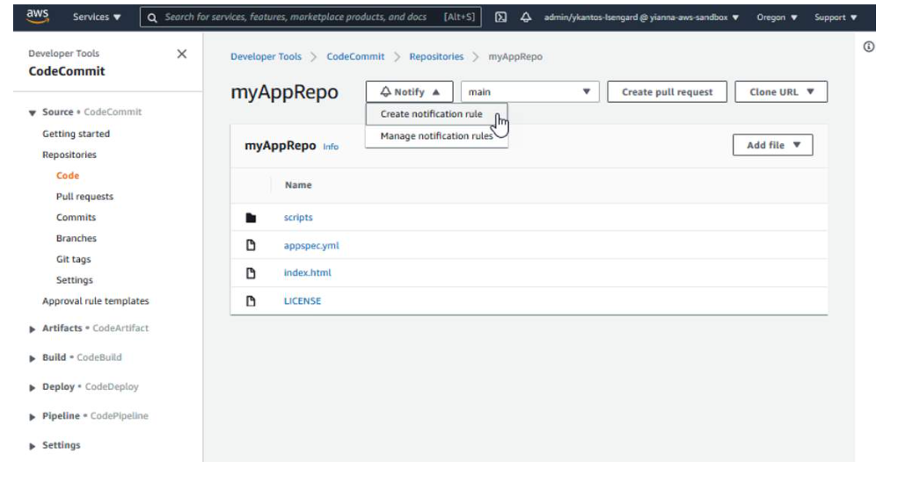

# AWS CodeCommit
AWS CodeCommit is a fully managed source control service that hosts secure Git-based repositories. A repository is a fundamental version control object in CodeCommit, and it stores your project files and source code.

## With CodeCommit you can:
- Eliminate the administrative overhead of managing your own hardware and software needed to store your code. CodeCommit is fully managed, highly available, and has no limits in the type or size of files it can store.
- Collaborate with your team on code using Git commands they already know. CodeCommit is a secure Git-based repository that can handle large numbers of files, code branches, and lengthy revision histories. 
- Improve your existing workflow by integrating CodeCommit with other AWS services, IDEs, and third-party software (for example, Jira).

# Monitoring
You can create notifications and trigger actions based on events such as creation of a branch, or when a commit is made.

# Security
From a security perspective, access to the repository is managed with policies and user accounts. A version of the repository is found in the cloud, and can be assessed through HTTPS or Secure Shell (SSH). The data is encrypted at rest and in transit.

# How it works
In CodeCommit, you create a repository. Users clone it to their environments, creating their own copy of the repository. After making changes, they push those changes back to the CodeCommit repository. The CodeCommit repository is managed with Git source control. Git commands (such as git add, git push, git branch) can be used to work and collaborate on the code. If it is part of a pipeline, CodeCommit can start the pipeline when a new code change is made on the configured CodeCommit repository and branch.

Below is a screen-capture of a CodeCommit repository named myAppRepo, and the files it contains. You are looking at the main branch. Notifications can be created and sent, based on what is happening in your repository. Note the Developer Tools panel which can be used to access other services, like CodeBuild, CodeDeploy, and CodePipeline.

