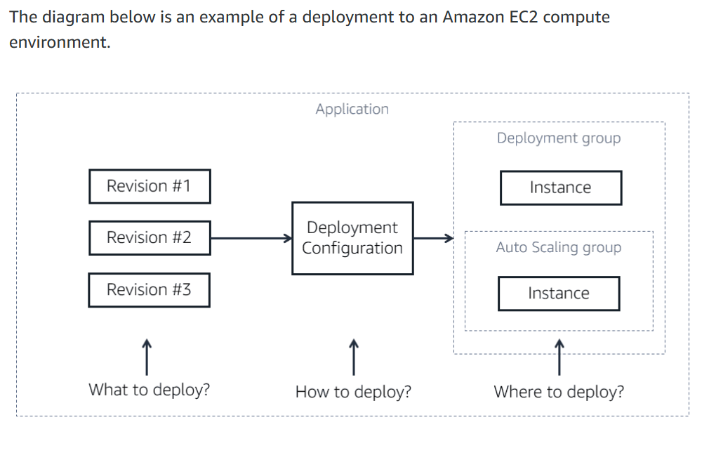

# AWS CodeDeploy
AWS CodeDeploy is a fully managed service that automates your software deployments, allowing you to deploy reliably and rapidly. It automates code deployment to a variety of compute services, including Amazon Elastic Compute Cloud (Amazon EC2), AWS Fargate, AWS Lambda, or on-premises servers. 

## With CodeDeploy you can:

- Deploy server, serverless, or container applications.
- Automate deployments and eliminate the need for manual, error-prone operations. With CodeDeploy you can reliably and rapidly release new features and updates. 
- Deploy on a variety of compute platforms including: AWS Lambda, Amazon ECS, Amazon EC2, or on-premises. You can even configure CodeDeploy to deploy to an Amazon EC2 Auto Scaling group, which will prepare the environment before traffic is sent to it.
- Concurrently deploy to one or multiple instances as the service scales to fit your needs.
- Minimize production downtime for your application by specifying if an update will be applied on an existing instance, or a newly provisioned environment that will replace the previous environment. You can also control how to handle the traffic-shifts from older to new versions. For example, if your application needs at least 50% of the instances in a deployment group to be up and serving traffic, you can specify that in your deployment configuration so that a deployment does not cause downtime.
- Automatically (or through user intervention) stop an unsuccessful deployment and roll back your deployment to a previous version.  

## Monitoring
AWS provides various tools that you can use to monitor CodeDeploy, including CloudWatch alarms, the CodeDeploy console and more.

## Security 
You can configure CodeDeploy to meet your security and compliance objectives. For more information on security, see Security in AWS CodeDeploy.

 The concept of an application is used by CodeDeploy to ensure it knows what to deploy (correct revision of code), where to deploy (deployment group), and how to deploy (deployment configuration).
## Code 
- Identify the correct version (revision) of the code.
- With the code, you provide an application specification file (AppSpec file) which is used to manage each deployment. During deployment, CodeDeploy looks for your AppSpec file in the root directory of the application's source. 
- The AppSpec file specifies where to copy the code and how to get it running. For example, it tells CodeDeploy how to stop the application if it is already running, how to install the code, what command to run before and after the code is installed, and how to get the application running again.

## Deployment group
- A deployment group specifies the deployment targeted environment. The information it contains is specific to the target compute platform: AWS Lambda, Amazon ECS, Amazon EC2, or on-premises. For example, Amazon ECS lets you specify the Amazon ECS service, load balancer and more. For Amazon EC2, it is a logical group of deployment target instances or physical environments.
- A CodeDeploy application can have one or more deployment groups.
- Security needs to be assigned so the environment can communicate with CodeDeploy.
- The CodeDeploy agent is needed if you are deploying to Amazon EC2 or an on-premises compute platform. It is installed and configured on the target instances. It accepts and executes requests on behalf of CodeDeploy.

## Deployment configuration 
- A deployment configuration is a set of deployment rules and deployment success and failure conditions used by AWS CodeDeploy during a deployment. For an Amazon EC2 compute platform, it specifies the number or percentage of instances that must remain available during deployment. It also specifies if an instance in the deployment group is briefly taken offline and updated with the latest code revision, or if a new instance replaces the instances in the deployment group.

