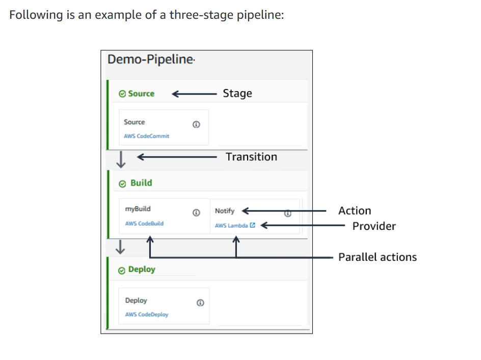

# AWS CodePipeline
AWS CodePipeline is a continuous delivery service that enables you to model, visualize, and automate the steps required to release your software. 

## With CodePipeline you can:
-Capture and visualize your pipeline, run it, view real-time status, and retry failed actions.
-Automate your release processes, eliminating human error, speed up delivery, and improve the quality of the release. 
-Establish consistency in the release.
-Incorporate your source, build, and deploy tools.
-View pipeline history details.
-Integrate with third-party and AWS tools to build, test, and deploy your code when notified of a code change. 

## Monitoring
You can monitor your pipeline in a number of ways to assure its performance, reliability, and availability, and to find ways to improve it. You can monitor the pipeline directly from the AWS CodePipeline console, the command line interface (CLI), use Amazon EventBridge, or AWS CloudTrail.

## Security
Security is an important part of any pipeline. CodePipeline supports resource-level permissions, enabling you to specify which user can perform what action on the pipeline. Some users might have read-only access to the pipeline, while others might have access to a particular stage or action within a stage. 

## How it works?
With CodePipeline, you model your release process with a number of stages and actions. CodePipeline breaks up your release workflow into a series of stages, such as code, build, and test. Each stage can have a number of actions that need to be performed. 

Actions are tasks that can run in sequence or in parallel to each other. Actions are associated with a service provider that runs the action, or they can require user intervention. Service providers can be AWS services (like CodeBuild, Amazon Simple Storage Service (Amazon S3), AWS Lambda, and AWS CloudFormation), or third-party services (like Jenkins and TeamCity). 

## Action types include: 
-Source (where the source is stored)
-Build (how to build the application)
-Test  (how to test the application)
-Deploy (how to deploy the application)
-Approval (manual approval and notifications)
-Invoke (Invoke a custom function).

